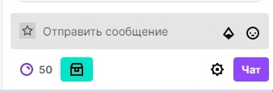

# Autoloot snippet
This short snippet I wrote to autoloot bonus chest with channel points on twitch.    
    
It appeared every 15 min in div `tw-button--success`. I simply check over time intervals if such DOM element exists and if `true` trigger click event for it. It works in full screen mode.   
There are many Chrome extensions that do this task much better, but I just wanted to look for my own solution.